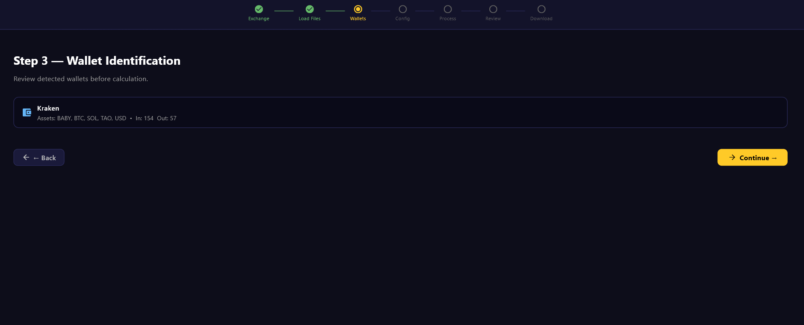
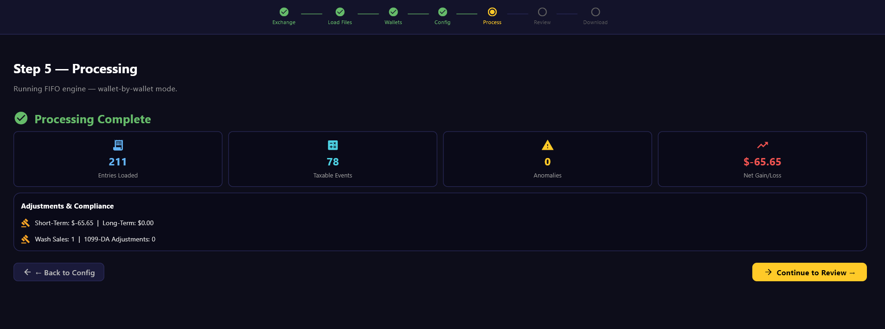

# Crypto Tax Pro 🚀

**Crypto Tax Pro** is a high-performance, privacy-first cryptocurrency tax calculator. Designed for the modern investor, it allows you to process thousands of transactions locally, ensuring your financial data never leaves your machine.

---

## 🖼️ Visual Walkthrough

| Welcome Screen | Data Mapping (Step 3) | Analysis (Step 5) |
| :---: | :---: | :---: |
|  |  |  |

> [!TIP]
> The app features a 7-step wizard that guides you from raw exchange data to completed tax forms in minutes.

---

## ✨ Key Features

*   🔒 **Privacy First:** 100% local processing. No cloud, no tracking.
*   📊 **Audit-Ready Reports:** Generates IRS-compliant Form 8949 (CSV), TurboTax imports, and a detailed Audit Trail.
*   🛡️ **IRS 2026 Ready:** Implements strict "Wallet-by-Wallet" tracking as per Rev. Proc. 2024-28.
*   🧠 **Smart Detection:** Automatically flags anomalies, missing cost basis, and wash sales.
*   🎨 **Modern UI:** Sleek, user-friendly 7-step wizard built with Python and Flet.

---

## 🔄 System Workflow


---

## 🛠️ Getting Started

### Prerequisites
- Python 3.10+
- [Flet](https://flet.dev/) and dependencies (see `requirements.txt`)

### Quick Start
1.  **Clone the Repo**
    ```bash
    git clone https://github.com/yourusername/crypto-tax-pro.git
    cd crypto-tax-pro
    ```
2.  **Set Up Environment**
    ```bash
    python -m venv .venv
    # Windows: .venv\Scripts\activate | Linux/macOS: source .venv/bin/activate
    pip install -r requirements.txt
    ```
3.  **Run the App**
    ```bash
    python app/main_gui.py
    ```

---

## 📖 Documentation & Technicals

### [Technical Reference](docs/TECHNICAL_REFERENCE.md)
*   **Wallet-by-Wallet Tracking**: Complies with IRS 2026 standards (Rev. Proc. 2024-28).
*   **High Performance**: Processes 10k+ transactions in seconds using optimized FIFO engines.
*   **Local Security**: All data stays in `data/` and is never transmitted online.

### [Build & Compilation](docs/BUILD_GUIDE.md)
*   **Cross-Platform**: Compile to native `.exe` (Windows), `.apk` (Android), or `.ipa` (iOS).
*   **Production Ready**: Detailed steps for icon generation and code protection.

### [Contributing Guidelines](CONTRIBUTING.md)
We welcome community contributions! Please check our guidelines and [Code of Conduct](CODE_OF_CONDUCT.md).

---

## 📜 Audit Trace & Reporting
The tool identifies "Orphan Inflows" (transfers from unknown sources) and forces a $0 cost basis if no history is found, ensuring you are never over-exposed in an audit.

---

## ⚠️ Disclaimer
*This tool is for informational purposes only. The developers are not tax professionals or CPAs. Cryptocurrency tax laws vary by jurisdiction and are subject to change. Always verify your results with a qualified professional before filing.*

---

## 📜 License
Distributed under the MIT License. See `LICENSE` for more information.
