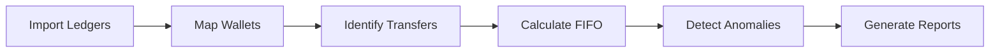

# Crypto Tax Pro 🚀

**Crypto Tax Pro** is a high-performance, privacy-first cryptocurrency tax calculator. Built for the modern investor, it processes thousands of transactions locally, ensuring your financial data never leaves your machine.

---

## 🖼️ Visual Walkthrough


*A premium dark-themed dashboard featuring a 7-step wizard navigation, multi-asset charts, and monthly breakdown insights.*

---

## 🏆 Why Crypto Tax Pro?

| Feature | Advantage |
| :--- | :--- |
| **Privacy First** | 100% local processing. No cloud, no tracking. |
| **Audit-Ready** | IRS-compliant Form 8949 (CSV), TurboTax imports, and Audit Trails. |
| **Integrated Rewards** | Automatically tracks "Net Impact" by combining capital gains and rewards. |
| **Smart Detection** | Flags anomalies, missing cost basis, and wash sales in real-time. |
| **IRS 2026 Ready** | Strict "Wallet-by-Wallet" tracking (Rev. Proc. 2024-28 compliance). |

---

## ✨ Key Features

*   🔒 **Local Security:** No data leaves `data/`. No external API keys required for calculation.
*   📊 **Robust Monthly Grouping:** Advanced date parsing for consistent multi-year reporting.
*   🛡️ **Net Impact Tracking:** Full visibility into Sales + Ordinary Income (Staking/Earn) per month.
*   🧠 **Intelligent Parsing:** Supports Kraken, Coinbase, Binance, and custom ledger formats.
*   🎨 **Premium Experience:** Sleek Python-Flet GUI with glassmorphism and real-time validation.

---

## 🔄 System Workflow



---

## 🛠️ Getting Started

### Prerequisites
- Python 3.12+ (Recommended)
- [Flet](https://flet.dev/)
- [Pandas](https://pandas.pydata.org/) (for high-speed grouping)

### Quick Start
1.  **Clone the Repo**
    ```bash
    git clone https://github.com/yourusername/crypto-tax-pro.git
    cd crypto-tax-pro
    ```
2.  **Set Up Environment**
    ```bash
    python -m venv .venv
    # Windows: .venv\Scripts\activate | Linux/macOS: source .venv/bin/activate
    pip install -r requirements.txt
    ```
3.  **Run the App**
    ```bash
    python app/main_gui.py
    ```

---

## 📖 Documentation & Technicals

### [Technical Reference](docs/TECHNICAL_REFERENCE.md)
*   **Wallet-by-Wallet Tracking**: Complies with IRS 2026 standards.
*   **High Performance**: Processes 10k+ transactions in seconds.

### [Windows Build Guide](docs/WINDOWS_BUILD_GUIDE.md)
*   **Compilation**: Step-by-step guide to build a standalone `.exe`.
*   **Prerequisites**: Detailed instructions for Flutter SDK and Visual Studio setup.

### [Contributing Guidelines](CONTRIBUTING.md)
We welcome community contributions! Please check our guidelines and [Code of Conduct](CODE_OF_CONDUCT.md).

---

## 📜 Audit Trace & Reporting
The tool identifies "Orphan Inflows" (transfers from unknown sources) and applies cost basis logic based on configured safe harbors, ensuring accuracy and audit protection.

---

## 🗺️ Roadmap

### 📍 Phase 1: Engine Consolidation (COMPLETED)
- [x] Refactor grouping logic to use Pandas.
- [x] Integrate Ordinary Income into Monthly Breakdown.
- [x] Fix Step 1 layout and exchange branding.

### 📍 Phase 2: Multi-Exchange Expansion (Q3 2026)
- [x] Native support for Coinbase CSV exports.
- [ ] Direct MetaMask/Etherscan wallet syncing.
- [ ] Automated fee calculation optimization for L2s.

### 📍 Phase 3: Advanced Tax Engines (2027)
- [ ] **Tax-Loss Harvesting Advisor**: Real-time identification of opportunities.
- [ ] **NFT Tracking**: Full support for ERC-721 and ERC-1155.
- [ ] Export to professional tax software (Standard XML format).

---

## ⚠️ Disclaimer
*This tool is for informational purposes only. The developers are not tax professionals or CPAs. Cryptocurrency tax laws vary by jurisdiction. Always verify your results with a qualified professional before filing.*

---

## 📜 License
Distributed under the MIT License. See `LICENSE` for more information.
