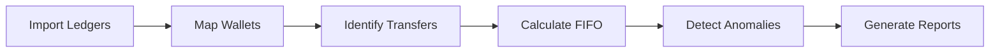

# Crypto Tax Pro 🚀

**Crypto Tax Pro** is a high-performance, privacy-first cryptocurrency tax calculator. Designed for the modern investor, it allows you to process thousands of transactions locally, ensuring your financial data never leaves your machine.

---

## ✨ Key Features

*   🔒 **Privacy First:** 100% local processing. No cloud, no tracking.
*   📊 **Audit-Ready Reports:** Generates IRS-compliant Form 8949 (CSV), TurboTax imports, and a detailed Audit Trail.
*   🛡️ **IRS 2026 Ready:** Implements strict "Wallet-by-Wallet" tracking as per Rev. Proc. 2024-28.
*   🧠 **Smart Detection:** Automatically flags anomalies, missing cost basis, and wash sales.
*   🎨 **Modern UI:** Sleek, user-friendly 7-step wizard built with Python and Flet.

---

## 🔄 System Workflow



---

## 🛠️ Getting Started

### Prerequisites
- Python 3.10 or higher
- [Poetry](https://python-poetry.org/) or `pip`

### Installation
1.  **Clone the Repo**
    ```bash
    git clone https://github.com/yourusername/crypto-tax-pro.git
    cd crypto-tax-pro
    ```
2.  **Set Up Environment**
    ```bash
    python -m venv .venv
    # Windows: .venv\Scripts\activate | Linux/macOS: source .venv/bin/activate
    pip install -r requirements.txt
    ```

---

## 🚀 Usage

### Graphical Interface
The easiest way to calculate your taxes. Perfect for most users:
```bash
python app/main_gui.py
```

### Advanced CLI
For power users and automation:
```bash
python main.py --help
```

---

## 📖 Documentation
For more detailed information, check out our documentation:
- [Technical Reference](docs/TECHNICAL_REFERENCE.md)
- [Build and Compilation Guide](docs/BUILD_GUIDE.md)
- [Contributing Guidelines](CONTRIBUTING.md)

---

## ⚠️ Disclaimer
*This tool is for informational purposes only. The developers are not tax professionals or CPAs. Cryptocurrency tax laws vary by jurisdiction and are subject to change. Always verify your results with a qualified professional before filing.*

---

## 📜 License
Distributed under the MIT License. See `LICENSE` for more information.
