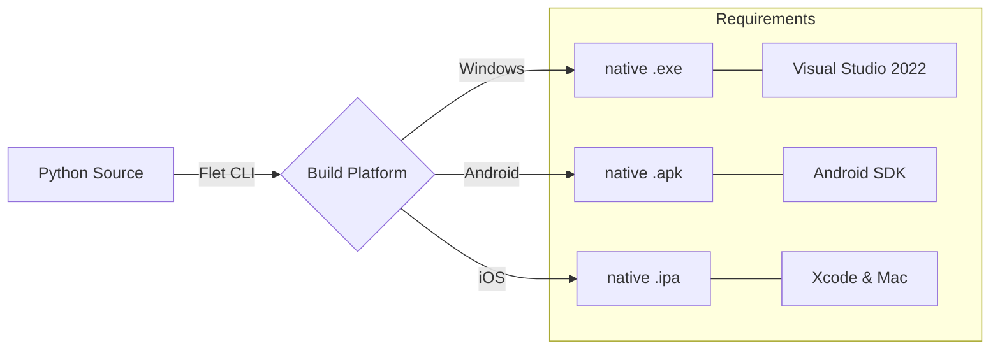

# Compilation Guide — Crypto Tax Pro

This guide details the steps to generate native executables for Windows and mobile applications for Android and iOS.

## 1. System Requirements

### General
*   **Developer Mode (Windows Developer Mode)**: **Mandatory** to allow the creation of symbolic links (symlinks) during compilation.
    *   Enable in: *Settings > Privacy & security > For developers > Developer Mode*.
*   **Flutter SDK**: Essential for the rendering engine.
    *   Download: [flutter.dev](https://docs.flutter.dev/get-started/install/windows)
    *   Installation: Extract to `C:\src\flutter`.
    *   PATH: Add `C:\src\flutter\bin` to your environment variables.
*   **Flet Python Package**: Ensure you have Flet installed in your environment.

### Platform Specifics
*   **Windows**: Visual Studio 2022 with the "Desktop development with C++" workload.
*   **Android**: Android Studio with Android SDK and Command-line Tools.
*   **iOS**: Mac computer with macOS and Xcode (It is not possible to compile for iOS from Windows).

---

## 2. Build Process



### Installation of Flet CLI
Before building, ensure you have the Flet CLI installed:
```bash
pip install flet
```

---

## 3. Compilation Commands (Flet)

Make sure you have your virtual environment active (`.venv`) before running these commands:

### Windows (.exe)
```powershell
flet build windows
```
The result will be located in: `build/windows`

### Android (.apk)
```powershell
flet build apk
```
The result will be located in: `build/apk`

### iOS (Mac only)
```bash
flet build ipa
```

---

## 4. Technical Notes
*   **Icons**: Application icons are automatically generated from resources in the `assets/` folder.
*   **Data Files**: Kraken CSV files in `data/` are not packaged by default for privacy reasons. Users must select them manually within the compiled app.
*   **Optimization**: For production distribution, consider using `nuitka` for source code protection as mentioned in the [Technical Reference](TECHNICAL_REFERENCE.md).
