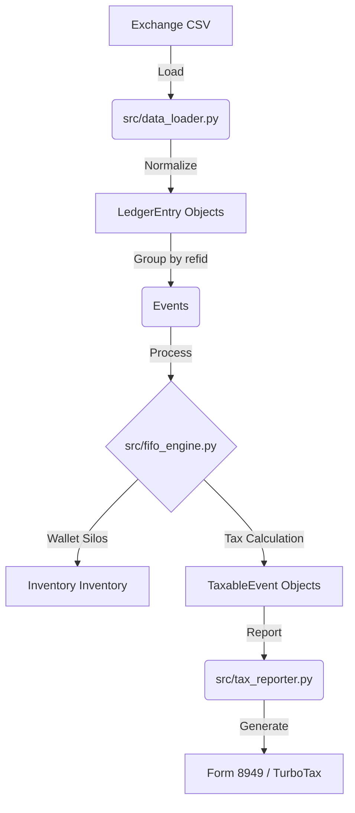

# Crypto Tax Pro 2026 - Technical Reference Guide

This document details the architecture, data model, and compliance guarantees of the Crypto Tax Pro commercial application.

## 1. "Wallet-by-Wallet" Architecture (IRS 2026)

Unlike traditional tools that use a global asset pool, this application implements a segregated tracking engine per wallet (`wallet-by-wallet`), complying with the **Rev. Proc. 2024-28** directive.

### Specific Identification Logic
- **Siloed Inventory**: Inventory is stored internally as a composite key `(wallet_id, asset_symbol)`.
- **Internal Transfers**: Movements between wallets (e.g., from an exchange to a hardware wallet) are processed as inventory transfers, migrating the original acquisition date and cost basis without triggering a taxable event.
- **Zero-Cost Detection**: In the absence of history (Missing Basis), the system automatically assigns a $0 cost and generates an alert in the Audit Trail, protecting the taxpayer during audits.

## 2. System Components

### Architecture Overview

### `src/models.py`
Defines the atomic objects of the system:
- `LedgerEntry`: Raw exchange record enriched with a `wallet_id`.
- `AssetLot`: Specific currency lot with tracking of its accounting "birthplace".
- `TaxableEvent`: The final result (Proceeds vs. Basis).

### `src/fifo_engine.py` (The Heart)
Implements the FIFO (First-In-First-Out) algorithm restricted by the boundaries of each wallet. It includes the `_move_lots` logic to reconcile transfers.

### `src/data_loader.py`
Normalizes CSVs from Kraken and other exchanges into an agnostic format. It groups transactions by `refid` to identify atomic multi-leg operations.

## 3. Security and Commercial Distribution

### Code Signing & Notarization
- **Windows**: The executable must be signed with certificates that comply with the 460-day rule of the CA/Browser Forum.
- **macOS**: Strict compliance with Gatekeeper via Apple Developer membership for Apple Silicon CPUs.

### IP Protection
- **Native Compilation**: Use of **Nuitka** to convert Python scripts into machine code (C), eliminating the possibility of simple bytecode decompilation.
- **Licensing**: Integration with the **Lemon Squeezy** API and layer obfuscation using **PyArmor** linked to the Hardware ID (HWID).

## 4. Legal Mitigation (Hold Harmless)
The application includes a conspicuous legal notice stating:
- It is not CPA advice.
- The user is ultimately responsible for the integrity of the data.
- Exemption from liability for fines derived from discrepancies in Form 1099-DA.
